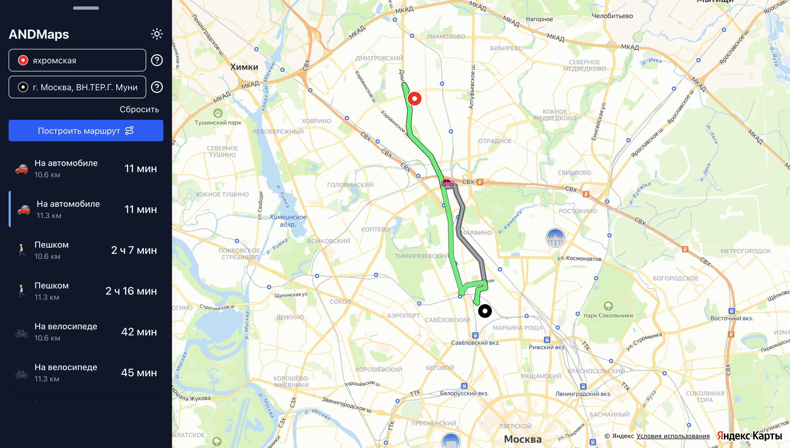
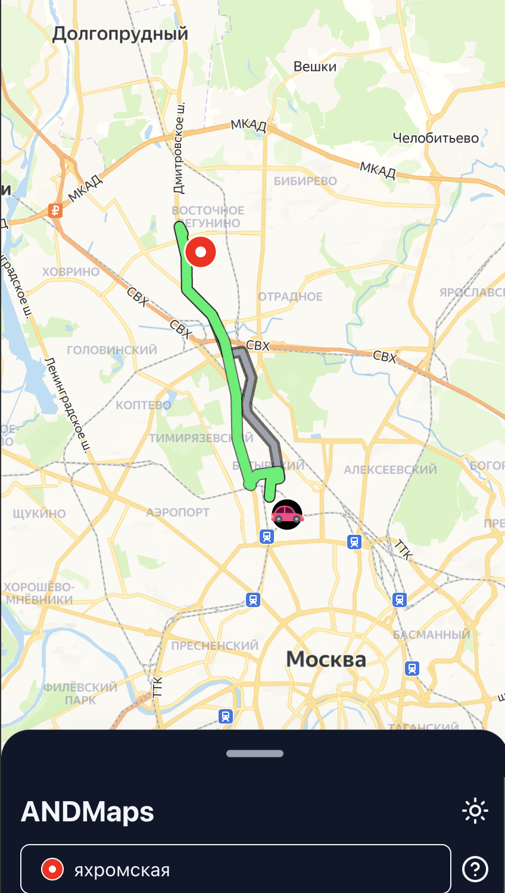

## Andmaps
---
## Запуск
```
npm install
npm run dev
```
---
### Основные функции
- Вывод карты yandex
- Построение маршрутов
  - Точки откуда  и куда по умолчанию
  - Определение текущего местоположения
  - Предложение нескольких маршрутов
  - Выбор маршрута
  - Выбор транспорта
  - Подробная информация о маршруте
  - Цетрирование карты при выборе шага маршрута
- Сохранение истории маршрутов
- Переключение светлой/темной темы
- Адаптивный интерфейс (мобильный + десктоп)
- Анимация машинки на построенном маршруте
---
### Технологии
- React 19 + Typescript
- Yandex API (ymaps3, JavaScript API и HTTP Геокодер, Геосаджест)
- IP API
- router.project-osrm API
- Vite
- Tailwind CSS
- Zustand
- Lucide React (иконки)
- Framer Motion

---


